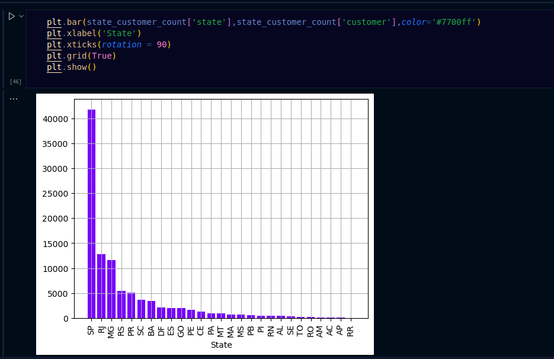
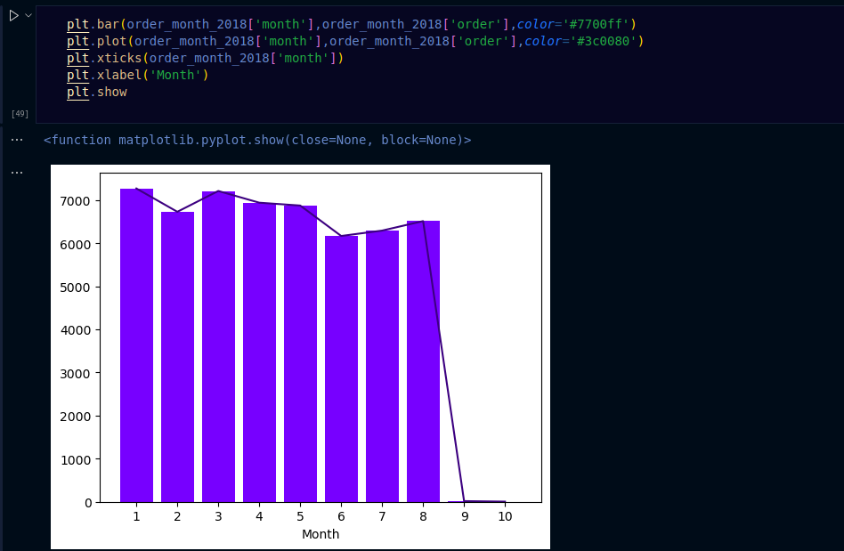
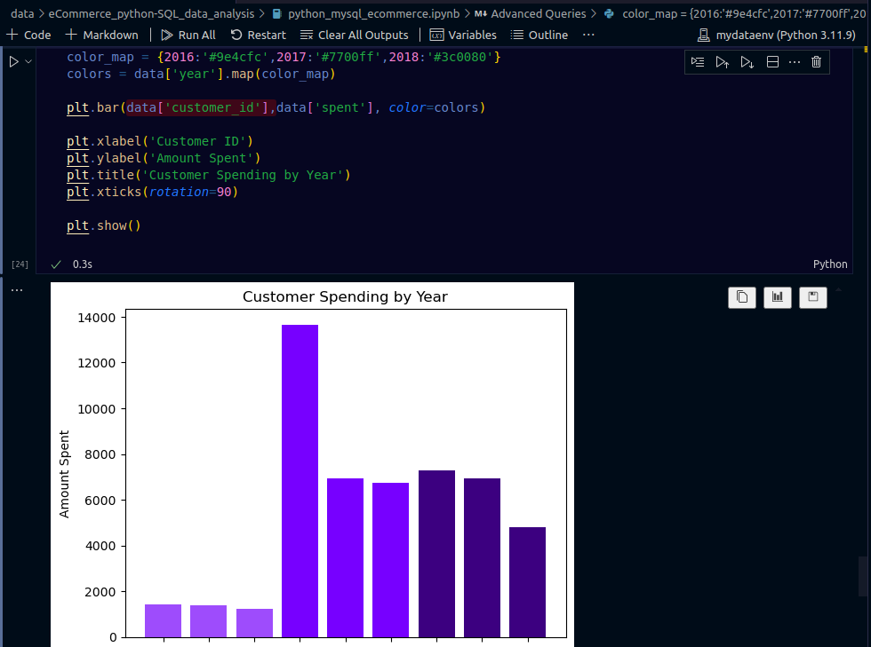

# E-commerce Data Analysis on Target Dataset

This project focuses on analyzing an e-commerce dataset from Target, sourced from Kaggle. The primary goal was to solve a variety of analytical problems using SQL queries and visualize some key insights. The project was divided into three levels of complexity: basic, intermediate, and advanced queries.

## Project Structure

### Basic Queries
1. **List of Unique Cities:** Identified all unique cities where customers are located.
2. **Order Count for 2017:** Calculated the total number of orders placed in 2017.
3. **Sales per Category:** Determined the total sales for each product category.
4. **Installment Payments:** Calculated the percentage of orders paid in installments.
5. **Customer Count by State:** Counted the number of customers from each state.

### Intermediate Queries
1. **Monthly Orders in 2018:** Analyzed the number of orders placed per month in 2018.
2. **Average Products per Order by City:** Computed the average number of products per order, grouped by customer city.
3. **Revenue Contribution by Category:** Determined the percentage of total revenue contributed by each product category.
4. **Correlation Analysis:** Identified the correlation between product price and the frequency of purchases.
5. **Revenue by Seller:** Calculated the total revenue generated by each seller and ranked them accordingly.

### Advanced Queries
1. **Moving Average of Order Values:** Computed the moving average of order values for each customer over their order history.
2. **Cumulative Monthly Sales:** Calculated cumulative sales per month for each year.
3. **Year-Over-Year Growth Rate:** Analyzed the year-over-year growth rate of total sales.
4. **Customer Retention Rate:** Calculated the retention rate of customers, defined as the percentage of customers who made another purchase within six months of their first purchase.
5. **Top 3 Customers by Year:** Identified the top 3 customers who spent the most money each year.

## Visualizations
The following queries were visualized:
- **Customer Count by State (Basic Query 5)**<br/>
<br/><br/>
- **Monthly Orders in 2018 (Intermediate Query 1)**<br/>
<br/><br/>
- **Top 3 Customers by Year (Advanced Query 5)**<br/>
<br/><br/>

## Tools and Technologies
- **Python:** Used to convert CSV datasets into a database.
- **MySQL:** Used for running SQL queries.
- **Python MySQL Connector:** Used to execute queries from Python.
- **Pandas:** Used to convert query results into DataFrames for analysis.
- **Matplotlib:** Used for data visualization.

## Dataset
The dataset used for this project was sourced from Kaggle. You can find it here: [Target Dataset on Kaggle](https://www.kaggle.com/datasets/devarajv88/target-dataset?select=products.csv).

## References
The questions used for this analysis were collected, and you can view them [here](https://github.com/Ayushi0214/SQL-Python-Ecommerce-Project/blob/main/Questions.txt).

## Getting Started
To explore the project, clone this repository and ensure you have Python and MySQL installed. You'll also need to install the necessary Python libraries by running:

```bash
pip install pandas mysql-connector-python matplotlib
